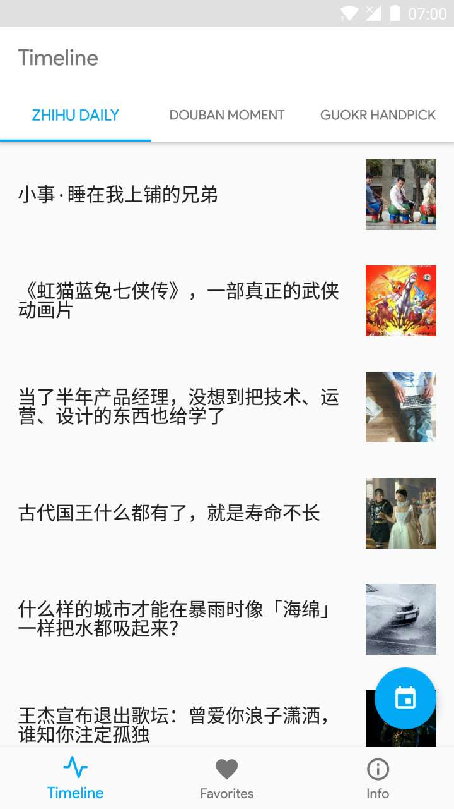
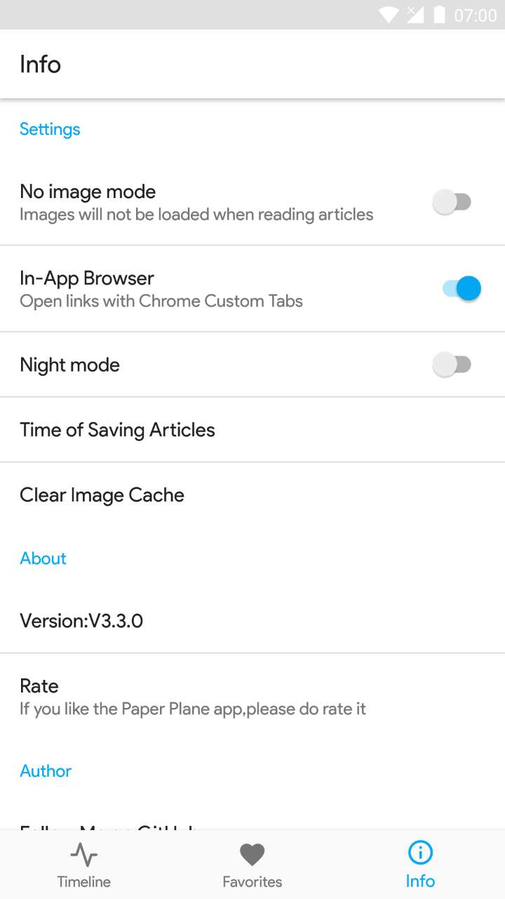
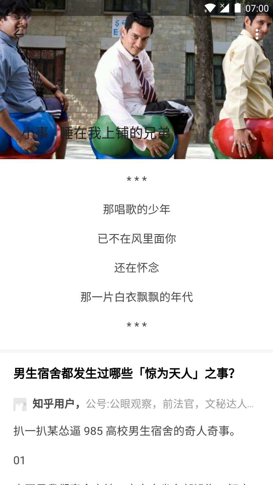

# Paper Plane

## Introduction
Paper Plane is an Android reading app containing articles from [Zhihu Daily](https://daily.zhihu.com/), [Guokr Handpick](http://www.guokr.com/mobile/) and [Douban Moment](https://moment.douban.com/app/). The project is built on [MVP architecture](https://github.com/googlesamples/android-architecture/tree/todo-mvp/) and design with [Material Design](https://material.io/) style.

## Screenshots
| Timeline    | Favorites    | Info | Details |
| :-------------: | :-------------: |:-------------: | :-------------: |
|  |  |  |  |

## Build
To open this project in Android Studio, begin by checking out of the branches, and then open the `PaperPlane/` dictionary in Android Studio. The following series of steps illustrate how to open the `PaperPlane` branch.

Clone the repository:
```
git clone https://github.com/marktony/PaperPlane.git
```

checkout the master branch:
```
git checkout master
```

Note: If you want to review a different branch, replace the `master` with the name you want to checkout like the `dev` (Confirm if the branch does exists).

Finally open the `PaperPlane/` directory in Android Studio.

## Google Play
[](https://play.google.com/store/apps/details?id=com.marktony.zhihudaily)

## Libraries
| Library     | Intro     |
| :------------- | :------------- |
| [Android Support Libraries](https://developer.android.com/topic/libraries/support-library/index.html) | The Android Support Library offers a number of features that are not built into the framework. These libraries offer backward-compatible versions of new features, provide useful UI elements that are not included in the framework, and provide a range of utilities that apps can draw on. |
| [Glide](https://github.com/bumptech/glide) | An image loading and caching library for Android focused on smooth scrolling. |
| [Gson](https://github.com/google/gson) | A Java serialization/deserialization library that can convert Java Objects into JSON and back. |
| [MaterialDateTimePicker](https://github.com/wdullaer/MaterialDateTimePicker) | Pick a date or time on Android in style. |
| [Retrofit](https://github.com/square/retrofit) | Type-safe HTTP client for Android and Java by Square, Inc. |
| [Room](https://developer.android.com/topic/libraries/architecture/room.html) | Room provides an abstraction layer over SQLite to allow fluent database access while harnessing the full power of SQLite. |

## Contributions
`Paper Plane` is a fully open sourced project. If you find a bug or want new features, do not hesitate to open an issue or create a pull request. Read the [CONTRIBUTION_GUIDELINES](CONTRIBUTION_GUIDELINES.md) for more detailed information.

## License

    Copyright 2016 lizhaotailang

    Licensed under the Apache License, Version 2.0 (the "License");
    you may not use this file except in compliance with the License.
    You may obtain a copy of the License at

        http://www.apache.org/licenses/LICENSE-2.0

    Unless required by applicable law or agreed to in writing, software
    distributed under the License is distributed on an "AS IS" BASIS,
    WITHOUT WARRANTIES OR CONDITIONS OF ANY KIND, either express or implied.
    See the License for the specific language governing permissions and
    limitations under the License.
